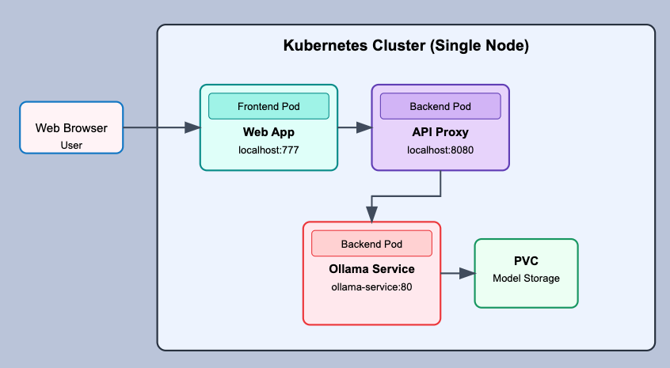

# AI Chat App with Kubernetes and Ollama
A locally-hosted web application enabling conversations with Foundation Models, powered by Kubernetes and Ollama.

## Overview

This project creates a complete local AI chat environment using Kubernetes to orchestrate all services. Users can interact with various Foundation Models through a browser-based interface, with all processing happening on your local machine - no cloud dependencies required.

## Key Technologies

### Kubernetes (K8s)
[Kubernetes](https://kubernetes.io/) is an open-source container orchestration platform that automates deploying, scaling, and managing containerized applications. In this project, Kubernetes handles the deployment and networking of all components, ensuring they work together seamlessly while providing scalability and resilience.

### Ollama
[Ollama](https://ollama.com/) is a lightweight framework for running and serving large language models locally. It simplifies running open-source AI models on personal computers by handling model downloading, optimization, and providing a consistent API for interacting with different models.

## Architecture

The application runs entirely within a single-node Kubernetes cluster with each component deployed in its own pod:



## Project Structure 

```
chat-ai-k8s-ollama/
├── frontend/
│   ├── src/                            # React application source files
│   └── Dockerfile                      # Container image definition for frontend Web App
├── backend/                            # Backend service implementations
│   ├── src/                            # React application source files for backend API Proxy
│   └── Dockerfile                      # Container image definition for backend API Proxy
└── k8s/                                # Kubernetes configuration files
    ├── frontend/
    │   ├── frontend-deployment.yaml   # Frontend pod deployment configuration
    │   └── frontend-service.yaml      # Frontend service network configuration
    └── backend/
        ├── api-proxy-deployment.yaml  # API proxy deployment configuration
        ├── api-proxy-service.yaml     # API proxy service configuration
        ├── ollama-deployment.yaml     # Ollama deployment configuration
        ├── ollama-service.yaml        # Ollama service configuration
        └── ollama-pvc.yaml            # Persistent Volume Claim for Ollama models
```

## Prerequisites
- Docker Desktop with Kubernetes enabled
- Container repository (e.g., Docker Hub)
- Node.js and npm for local development
- Minimum storage 3GB+ for Llama3.2 3B

## Getting Started

1. Clone the GitHub repository
    ```bash
    git clone https://github.com/MardiantoS/chat-ai-k8s-ollama.git
    cd chat-ai-k8s-ollama
    ```

### Ollama API Service

2. Deploy the Ollama API pod
    ```bash
    kubectl apply -f k8s/backend/ollama-pvc.yaml
    kubectl apply -f k8s/backend/ollama-deployment.yaml
    kubectl apply -f k8s/backend/ollama-service.yaml
    ```
Note: the Ollama API is using Llama3.2 3B model. If you'd like to use a different model, edit these files:`k8s/backend/ollama-deployment.yaml` and `backend/src/controllers/chatController.js`

### API Proxy
3. Build the API Proxy backend service container image and push the container image to your repository.
   
   Note: Replace `${CONTAINER_REPOSITORY}` with your own container repository (e.g., if you are using Docker Hub, this would be your username)

    ```bash
    docker build -t ${CONTAINER_REPOSITORY}/ollama-api-proxy:latest ./backend
    docker push ${CONTAINER_REPOSITORY}/ollama-api-proxy:latest
    ```

4. Edit `k8s/backend/api-proxy-deployment.yaml` and replace `CONTAINER_REPOSITORY` with your own container repository.

5. Deploy the API Proxy pod.

    ```bash
    kubectl apply -f k8s/backend/api-proxy-deployment.yaml
    kubectl apply -f k8s/backend/api-proxy-service.yaml
    ```

### Front-end Web App

6. Build the front-end React web app container image and push the container image to your repository. Same with step 3, replace `${CONTAINER_REPOSITORY}` with your own container repository

    ```bash
    docker build -t ${CONTAINER_REPOSITORY}/chat-app-frontend:latest ./frontend
    docker push ${CONTAINER_REPOSITORY}/chat-app-frontend:latest
    ```

7. Edit `k8s/frontend/frontend-deployment.yaml` and replace `CONTAINER_REPOSITORY` with your own container repository.

8. Deploy the Frontend Web App pod.

    ```
    kubectl apply -f k8s/frontend/frontend-deployment.yaml
    kubectl apply -f k8s/frontend/frontend-service.yaml
    ```

## Usage

Open a web browser and navigate to `http://localhost:777`. Here are some suggestions on queries you can ask:
- "Craft a haiku that captures the essence of Artificial Intelligence."
- "If you were explaining foundation models to a curious high school student, how would you break down the concept?"
- "Could you provide an accessible explanation of AI agents and their core functions?"

## License

This project is licensed under the MIT License - see the [LICENSE](LICENSE) file for details.

## Citation

If you use this work in your research or project, please use the following citation:
> Mardianto Hadiputro. (2025). AI Chat App with Kubernetes and Ollama. GitHub. https://github.com/MardiantoS/chat-ai-k8s-ollama